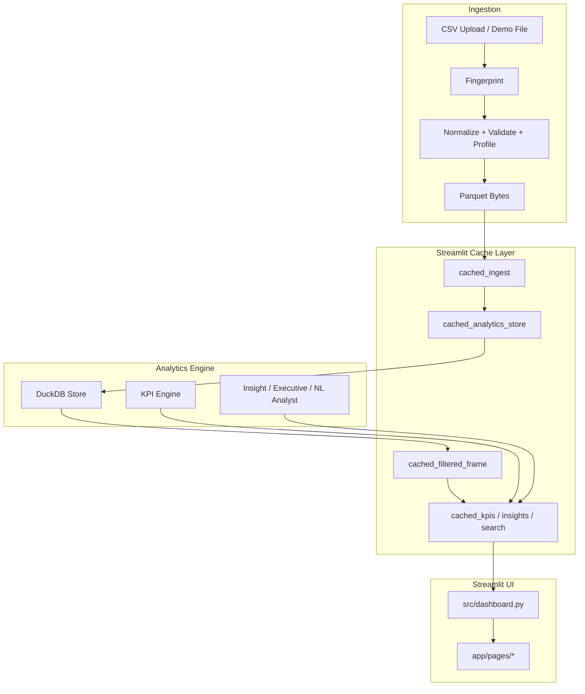

# Recruitment Intelligence Platform

**Turn recruitment operations data into executive KPIs, funnel intelligence, and natural-language analytics.**

Built for staffing and recruitment teams who need pipeline visibility beyond spreadsheet exports — with a domain-aware architecture, automated tests, and a live Streamlit deployment.

[](https://recruitment-analytics-platform-vkb.streamlit.app/)
[](https://www.python.org/)
[](https://github.com/veerendrakalyanbabu-VKB/Recruitment-Intelligence-Platform/actions/workflows/ci.yml)
[](tests/)
[](https://streamlit.io/)

---

## Live Demo

**https://recruitment-analytics-platform-vkb.streamlit.app/**

Entry point: `src/dashboard.py` · Python 3.12 recommended on Streamlit Community Cloud

## Overview

Recruitment Intelligence Platform is an analytics application for US IT staffing and recruitment operations. Upload a recruitment CSV (or use the built-in demo dataset), and the platform normalizes schema variants, validates data quality, computes funnel KPIs, and surfaces intelligence across recruiters, clients, sources, and roles.

This is **analytics and intelligence software**, not a full ATS replacement. Candidate management is included as an operational module; the core value is measurement, diagnosis, and decision support.

---

## Problem

Recruitment teams often work from exports and disconnected spreadsheets. That makes it hard to answer consistent questions:

- Where is the pipeline stalling (screening, interviews, offers, joining)?
- Which recruiters, clients, or sources perform differently?
- Which roles are hardest to close?
- How long are candidates aging in each stage?
- What changed period-over-period?

Manual reporting is slow, error-prone, and difficult to repeat when column names change between exports.

---

## Solution

A modular Python application that:

1. **Ingests** CSV uploads with flexible column mapping (`Interview_Status` + `Interview_Result` supported)
2. **Validates** schema, data quality, and health scoring
3. **Caches** normalized datasets by content fingerprint (Streamlit + DuckDB)
4. **Filters** without losing the canonical full dataset
5. **Computes** regression-tested KPIs and funnel metrics
6. **Delivers** executive, recruiter, client, and source intelligence in a Streamlit UI
7. **Supports** natural-language questions with a deterministic analyst (optional OpenAI enhancement)

---

## Key Capabilities

| Area | What it does |
|------|----------------|
| **Executive Intelligence** | Health score, KPI command center, funnel conversion, period comparisons, insight cards with evidence |
| **Recruiter Intelligence** | Scorecards, efficiency metrics, workload, team-relative performance |
| **Client / Source / Role Intelligence** | Demand, conversion, aging, and quality rankings by dimension |
| **Pipeline Aging** | Configurable thresholds (healthy / watch / aging) and risk scoring |
| **Forecasting** | Join forecasts and target-gap analysis from historical trends |
| **Natural Language Analytics** | Intent parsing + deterministic answers; optional `OPENAI_API_KEY` for LLM enhancement |
| **Data Quality** | Profiling, duplicate detection, mapping confidence, ingestion wizard |
| **Search & AI** | DuckDB-backed candidate search and analyst Q&A on the filtered scope |
| **Reports** | KPI export, filtered dataset download, forecast views |

**Dashboard tabs:** Executive · Pipeline · Interviews · Recruiters · Clients & Sources · Search & AI · Reports & Forecast

---

## Sample Dataset Metrics (not production results)

The bundled `sample_data/recruitment_dataset_10000.csv` is **synthetic sample data** for development and regression testing. Metrics below are from that sample file only — **not** real customer or production business outcomes.

| Metric | Sample 10k dataset |
|--------|---------------------|
| Applications | 10,000 |
| Interviews completed | 6,689 |
| Interview selection rate | 65.05% |
| Joined | 3,262 |
| Joining rate | 90.56% |

Demo dataset (`data/recruitment_data_cleaned.csv`): **1,000** applications (verified by tests).

---

## Performance Architecture

- **Dataset fingerprinting** — SHA-256 content hash keys ingest and cache entries
- **Parquet round-trip** — normalized data stored as parquet bytes for fast reload
- **Streamlit `cache_data` / `cache_resource`** — ingest, filters, KPIs, insights, search
- **DuckDB analytics store** — filtered queries and aggregations without replacing the canonical dataset
- **Filter-scoped cache keys** — full dataset remains available; filters derive subsets
- **Session-state isolation** — dataset-scoped filter widgets prevent cross-upload leakage

Set `RIOS_DEV_PERF=1` for sidebar diagnostics (row counts, filter keys, ingest timings).

---

## System Architecture



---

## Data Flow

```text
CSV upload
  → fingerprint (content hash)
  → cached_ingest (normalize, validate, profile, parquet)
  → AppContext.full_df (canonical dataset)
  → sidebar filters (dataset-scoped session keys)
  → cached_filtered_frame (DuckDB query)
  → cached_kpis / insights / search / analyst
  → Executive + domain pages
```

---

## Project Structure

```text
Recruitment-Analytics-Platform/
├── src/
│   ├── dashboard.py              # Streamlit entrypoint
│   ├── app/
│   │   ├── analytics/            # KPIs, funnel, DuckDB store, aging, forecast, domains
│   │   ├── data/                 # schema, loader, pipeline, fingerprint, validation
│   │   ├── intelligence/         # insights, executive, NL query, AI analyst
│   │   ├── pages/                # Executive, Pipeline, Interviews, Recruiters, etc.
│   │   ├── streamlit_cache.py    # Cached ingest, filter, KPI, search layer
│   │   ├── state.py              # Dataset-scoped filter session helpers
│   │   └── context.py            # AppContext (full vs filtered dataset)
│   ├── kpi_engine.py             # Backward-compatible re-exports
│   └── data_loader.py
├── pages/
│   └── candidate_management.py   # Streamlit multipage ATS-style module
├── tests/                        # 50 automated tests
├── sample_data/
│   └── recruitment_dataset_10000.csv
├── data/
│   └── recruitment_data_cleaned.csv   # 1k demo dataset
├── requirements.txt
└── .streamlit/config.toml
```

Legacy `src/db.py` (SQLite) remains for older scripts; **primary analytics path uses in-memory DuckDB** over parquet-loaded frames.

---

## Installation

```bash
git clone https://github.com/veerendrakalyanbabu-VKB/Recruitment-Analytics-Platform.git
cd Recruitment-Analytics-Platform
python -m venv .venv
# Windows: .\.venv\Scripts\Activate.ps1
# macOS/Linux: source .venv/bin/activate
pip install -r requirements.txt
```

**Requirements:** Python 3.12+ recommended · See `requirements.txt` for pinned dependencies.

---

## Local Development

```bash
# From repository root — PYTHONPATH must include src/
export PYTHONPATH=src          # macOS/Linux
# set PYTHONPATH=src           # Windows PowerShell

python -m streamlit run src/dashboard.py
```

Open `http://localhost:8501`

### Upload workflow

1. Sidebar → **Upload CSV**
2. Upload a recruitment export (e.g. `sample_data/recruitment_dataset_10000.csv`)
3. Review column mapping and data health in the ingestion wizard
4. Explore tabs — filters apply to the active dataset without replacing the canonical upload

---

## Testing

```bash
export PYTHONPATH=src
python -m pytest tests/ -v
```

**50 tests** covering KPI regression (demo + 10k sample), schema mapping, DuckDB filters, fingerprint stability, filter/session data flow, upload pipeline, insights, and phases 3–8 analytics modules.

---

## Deployment

### Streamlit Community Cloud

| Setting | Value |
|---------|--------|
| Repository | `veerendrakalyanbabu-VKB/Recruitment-Analytics-Platform` |
| Branch | `main` |
| Main file path | `src/dashboard.py` |
| Python | **3.12** |
| Dependencies | `requirements.txt` |

Live app: https://recruitment-analytics-platform-vkb.streamlit.app/

---

## Configuration

| Variable / secret | Purpose |
|-------------------|---------|
| `OPENAI_API_KEY` | Optional LLM enhancement for Search & AI analyst (env or Streamlit secrets) |
| `RIOS_DEV_PERF=1` | Development diagnostics in sidebar |

No API key is required for core analytics — the deterministic analyst works without external LLM calls.

---

## Security

- No credentials committed to the repository
- Optional API keys read from environment or Streamlit secrets at runtime
- Uploaded CSV data stays in the Streamlit session / server process (Community Cloud ephemeral environment)
- Do not commit `.env`, service account JSON, or recruitment PII exports

---

## Engineering Decisions

| Decision | Rationale |
|----------|-----------|
| DuckDB over SQLite for analytics | Fast filtered aggregations on in-memory frames without mutating canonical data |
| Fingerprint-keyed caching | Avoid re-ingesting identical uploads; isolate cache per dataset |
| Separate Status + Result columns | Matches real staffing exports (`Interview_Status=Completed` + `Interview_Result=Selected`) |
| Modular `app/pages/*` | Keeps `dashboard.py` thin; each tab is maintainable |
| Deterministic NL analyst first | Reliable demo without API dependency; LLM is optional |
| Pandas KPI engine | Regression-tested formulas; analytics store wraps DuckDB for filter/search |

---

## Known Limitations

- In-memory processing — very large files (250k+ rows) may stress Community Cloud memory
- Forecasting uses simple trend/average methods — not a full ML forecasting stack
- Candidate management module is operational, not a full ATS workflow engine
- Screenshots not yet committed to the repo (use live demo for visuals)
- GitHub Actions runs the test suite on pushes and pull requests; package publishing remains release-triggered

---

## Roadmap

- [x] CI workflow (`pytest` on push and pull request)
- [ ] Committed screenshots / short demo GIF
- [ ] Optional BigQuery export path for cloud analytics
- [ ] Deeper LLM analyst with structured evidence grounding
- [ ] Excel/PDF report export

---

## License

See repository license status on GitHub. Contact the author for usage questions.

---

**Built by [Veerendra Kalyan](https://github.com/veerendrakalyanbabu-VKB)** — US IT staffing domain experience · Python · data analytics · Streamlit · DuckDB
